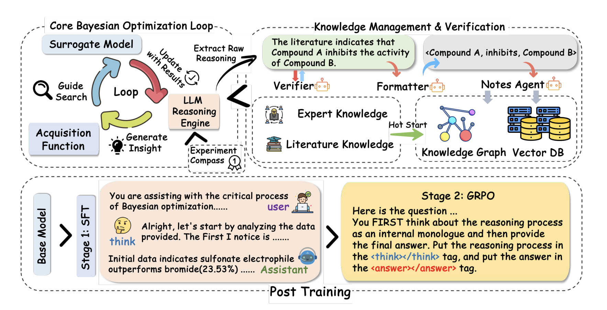

# Reasoning BO: Enhancing Bayesian Optimization with the Long-Context Reasoning Power of LLMs

## Overview

Our work introduces a novel Bayesian Optimization workflow that leverages the reasoning capabilities of large language models (LLMs) to enhance optimization performance. The architecture of our approach is depicted in the diagram below, which illustrates how we integrate knowledge-enhanced multi-agent systems into the optimization process.



The Bayesian Optimization workflow is built upon the [Ax Platform](https://ax.dev/). For the Knowledge-Enhanced Multi-Agent system, we use the [Camel Framework](https://docs.camel-ai.org/) to provide a simple and extensible interface for agent interactions, enabling robust reasoning over domain-specific knowledge.

For more details on how Bayesian Optimization is implemented within the Ax framework, and for a hands-on experience with our algorithms, you can explore the Jupyter notebooks available in the `recipes` directory. These notebooks provide interactive examples and tutorials to help you get started.

## Table of Contents

1. [Installation](#installation)
2. [Quick Start](#quick-start)
3. [Customizing Experiments](#customizing-experiments)
4. [Acknowledgments](#acknowledge)

## Installation

```bash
conda create -n bo python==3.10
conda activate bo
pip install uv
uv pip install -e .

# others 
uv pip install ax-platform==0.5.0
uv pip install camel-ai==0.2.22

# quality
pip install swanlab
```

## Benchmarks

Below is a table summarizing the benchmarks used in this project. These benchmarks are categorized into two main groups: Real-World Tasks and Synthetic Functions. The relevant chemical datasets are included in the file `data/chemistry_data.zip`.

| Category                | Benchmark Name                                                                 | Metric Name       |
|------------------------|-------------------------------------------------------------------------------|-------------------|
| **Real-World Tasks**   | Suzuki-Miyaura cross-coupling                                                | suzuki            |
|                        | Direct Arylation                                                              | direct_arylation  |
|                        | Buchwald-Hartwig                                                             | buchwald  |
|                        | Chiral Phosphoric Acid–Catalyzed Thiol–Imine Addition                         | chiral_addition   |
|                        | Lunar Lander                                                                 | lunar      |
| **Synthetic Functions**| Rosenbrock Function                                                          | rosenbrock        |
|                        | Ackley Function                                                              | ackley            |
|                        | Hartmann Function                                                            | hartmann          |
|                        | Levy Function                                                               | levy              |

## Quick Start

To get started with the Reasoning BO framework, we have prepared a set of scripts in the `scripts` directory that simplify the process of setting up and running experiments. By configuring the necessary parameters in these scripts, you can launch an experiment with a single command:

```bash
source ~/.scripts/start_optimization.sh
```

### Parameters in `start_optimization.sh`

Below is a detailed explanation of the parameters that can be configured in the `start_optimization.sh` script to customize your experiments:

- **`--exp_config_path`**: Specifies the path to the experiment compass file.
- **`--metric_name`**: Indicates the benchmark task to be evaluated. Refer to the [Benchmarks](#benchmarks) section for a list of available metrics and their corresponding tasks.
- **`--model_type`**: Defines the model used for the experiment, as recorded on the SwanLab platform. For API-based models, specify the original model name in detail. Examples include:
  - `deepseek`: DeepSeek models.
  - `qwq-plus`: Qwen models.
  - `local-rl-14b`: Local reinforcement learning model with 14B parameters.
- **`--reasoner`**: Selects the reasoning model to use. Options are:
  - `deepseek`: Uses the DeepSeek API.
  - `qwq`: Uses the Baidu BaiLian platform API. Ensure the `QWQ_MODEL_NAME` is correctly set in the `.env` file to specify the desired model.
  - `local`: Uses a local model for inference.
- **`--result_dir`**: Specifies the directory where results will be saved. Defaults to the `data` folder.
- **`--model_path`**: Required only when using a local rl model. Indicates the path to the local model checkpoint.
- **`--num_iterations`**: Sets the number of iterations for the experiment. For testing purposes, 2 iterations are typically sufficient. Adjust based on the task and requirements.
- **`--seed`**: Sets the random seed for reproducibility.
- **`--enable_notes`**: Enables database storage for experiment notes. Include this parameter to activate the feature; omit it to disable.

These parameters allow you to fine-tune the behavior of the Reasoning BO framework according to your specific needs.

## Customizing Experiments

The core design of the Bayesian Optimization in this project is inspired by Ax Platform (<https://github.com/facebook/Ax>), making it simple and clear to customize Bayesian experiments. Below are the key steps:

1. **Defining Custom Metrics**  
   Inherit from Ax's `Metric` class, primarily overriding the `fetch_trial_data` method to calculate metrics such as mean and SEM from individual experiment configurations (arms). The calculation logic must be predefined.

   ```python
   from ax import Data
   import pandas as pd

   class BoothMetric(Metric):
       def fetch_trial_data(self, trial):
           records = []
           for arm_name, arm in trial.arms_by_name.items():
               params = arm.parameters
               records.append(
                   {
                       "arm_name": arm_name,
                       "metric_name": self.name,
                       "trial_index": trial.index,
                       "mean": (params["x1"] + 2 * params["x2"] - 7) ** 2 + (2 * params["x1"] + params["x2"] - 5) ** 2,
                       "sem": 0.0,
                   }
               )
           return Data(df=pd.DataFrame.from_records(records))
   ```

2. **Create Search Space**  
   Define a custom parameter search space by specifying the name, type, and range of parameters. Parameter classes include:
   - `RangeParameter`: Floats with defined ranges.
   - `ChoiceParameter`: Options with predefined values.
   - `FixedParameter`: Boolean values (`True` or `False`).  
   Additional constraints such as `SumConstraint` (sum of parameters) and `OrderConstraint` (parameter relationships) can also be applied.

   ```python
   hartmann_search_space = SearchSpace(
       parameters=[
           RangeParameter(
               name=f"x{i}", parameter_type=ParameterType.FLOAT, lower=0.0, upper=1.0
           ) for i in range(6)
       ]
   )

   parameters = [
       ChoiceParameter(
           name="Electrophile_SMILES",
           parameter_type=ParameterType.STRING,
           values=[
               "BrC1=CC=C(N=CC=C2)C2=C1",
               "ClC1=CC=C(N=CC=C2)C2=C1",
               "IC1=CC=C(N=CC=C2)C2=C1",
               "O=S(OC1=CC=C(N=CC=C2)C2=C1)(C(F)(F)F)=O",
           ],
       )
   ]
   ```

3. **Create Optimization Config**  
   Define the `OptimizationConfig` using objectives and outcome constraints.

   ```python
   param_names = [f"x{i}" for i in range(6)]
   optimization_config = OptimizationConfig(
       objective=Objective(
           metric=Hartmann6Metric(name="hartmann6", param_names=param_names),
           minimize=True,
       ),
       outcome_constraints=[
           OutcomeConstraint(
               metric=L2NormMetric(name="l2norm", param_names=param_names, noise_sd=0.2),
               op=ComparisonOp.LEQ,
               bound=1.25,
               relative=False,
           )
       ],
   )
   ```

4. **Define a Runner (Optional)**  
   Inherit from the `Runner` object and override the `run` method. This step handles the deployment logic for trials, returning result metadata that can be accessed via the `trial.run_metadata` attribute.

   ```python
   class MyRunner(Runner):
       def run(self, trial):
           trial_metadata = {"name": str(trial.index)}
           return trial_metadata
   ```

These steps provide a structured approach to customize Bayesian Optimization experiments within this framework. All benchmark metrics for Reasoning BO are encapsulated in the src/tasks directory.

## Acknowledge

We would like to express our gratitude to the following frameworks that have significantly contributed to our work:

1. **Ax Framework**: A powerful bayesian optimization framework developed by Facebook, available at [https://github.com/facebook/Ax](https://github.com/facebook/Ax).
2. **Camel Framework**: An extensible and well-structured multi-agent framework, designed for easy customization and integration. Accessible at [https://github.com/camel-ai/camel](https://github.com/camel-ai/camel).
3. **SwanLab**: An excellent platform for experiment tracking and management, found at [https://github.com/SwanHubX/SwanLab](https://github.com/SwanHubX/SwanLab).
